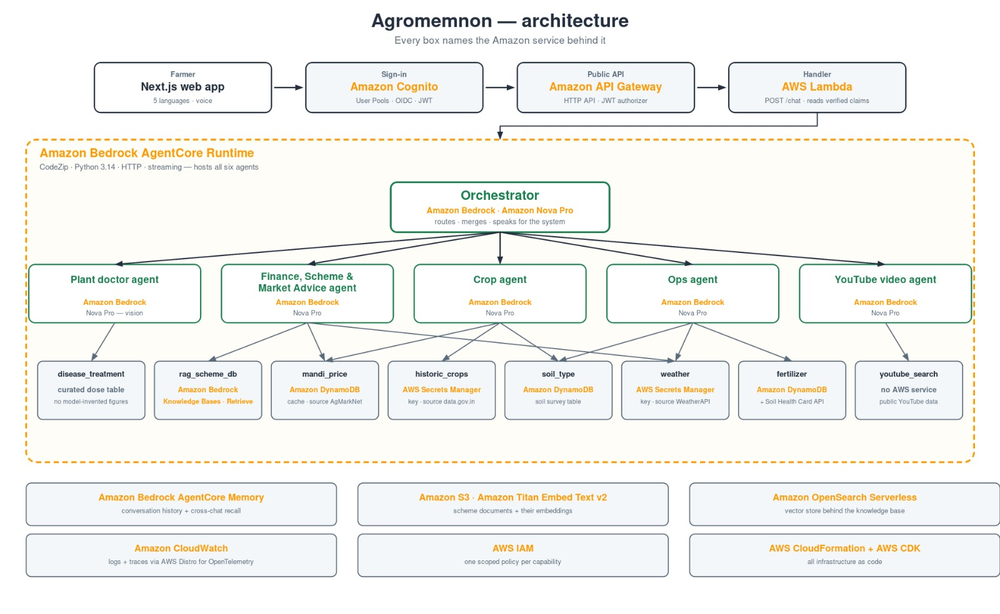

# Agromemnon

An agricultural advisory service for Indian farmers, built on the Strands Agents SDK
and Amazon Bedrock AgentCore.

A farmer signs in, asks a question in their own language — by voice or by typing — and
gets an answer grounded in their own district: which crop suits the coming season, what
the soil survey says about their block, today's mandi prices and whether to sell, the
fertilizer dose for a crop already in the ground, which government scheme applies and how
to apply for it, and what is wrong with the leaf in the photo they just took.

## Architecture



A turn travels the top row left to right: the Next.js app sends the question with the
farmer's Cognito ID token, API Gateway's JWT authorizer verifies it, and a Lambda reads
the verified claims and forwards them to the AgentCore runtime that hosts every agent.

## How a turn works

The orchestrator is the only agent the farmer talks to. It routes the question to the
specialists that can answer it, then merges what comes back into one reply.

| Agent | Answers | Tools it holds |
| --- | --- | --- |
| **Orchestrator** | Routes, merges, and speaks for the system | the five specialists below, as tools |
| **Crop agent** | What to grow — crop selection, seasonal and soil fit, switching crops | `soil_type`, `historic_crops`, `mandi_price` |
| **Operations agent** | Day-to-day field work — fertilizer doses, irrigation timing, spraying and harvest windows | `soil_type`, `weather`, `fertilizer_recommendation` |
| **Finance, scheme & market advice agent** | Money and markets — schemes, subsidies, insurance, loans, and when to sell | `rag_scheme_db`, `mandi_price`, `weather` |
| **Plant doctor** | Diagnoses disease from a photograph of an affected leaf | `disease_treatment` |
| **YouTube video agent** | Finds one video that *shows* the technique being asked about | `youtube_search` |

Specialists are separate agents with their own context, so the orchestrator builds the
farmer's profile into each specialist's system prompt rather than relying on it to
mention the district in every tool call.

`plant_doctor` is built apart from the others because a photograph does not fit through
the single string argument of a tool call. The uploaded image is stored by
`image_store.py`, which returns a short reference like `img_7f3a2b1c`; only that
reference travels through the model, and the specialist resolves it back to pixels.

### Tools

Every tool lives in its own module under `app/Agromemnon/tools/` and is registered by
name, so any agent can request it.

| Tool | What it returns | Source |
| --- | --- | --- |
| `soil_type` | Every macronutrient with its rating, pH, salinity, and which micronutrients an area is short of | [Soil Health Card nutrient survey](https://ckandev.indiadataportal.com/sv/dataset/soil-health-card), loaded into DynamoDB |
| `fertilizer_recommendation` | A dose for the crop and the plot | Soil Health Card API (`soilhealth.dac.gov.in`) |
| `mandi_price` | Today's prices across nearby markets | AgMarkNet, cached in DynamoDB |
| `historic_crops` | What the area has actually grown | `data.gov.in` |
| `weather` | Forecast for the district | WeatherAPI |
| `rag_scheme_db` | Passages from government scheme documents | Bedrock Knowledge Bases over S3 + OpenSearch Serverless |
| `disease_treatment` | Cultural steps and spray rates for a named disease | Curated reference table |
| `youtube_search` | One video a farmer can follow | Public YouTube data |

The soil survey behind `soil_type` is the Soil Health Card dataset published on the
[India Data Portal](https://ckandev.indiadataportal.com/sv/dataset/soil-health-card) —
block-level nutrient results aggregated from millions of sampled fields. It is streamed
into DynamoDB by `scripts/load_soil_nutrients.py`, which is what lets a farmer get a soil
picture and a fertilizer dose from their district alone, without holding a Soil Health
Card of their own. Every figure it returns is an area average from sampled fields, and the
caveat travels with the data so an answer never presents it as a measurement of one plot.

### Skills

Field procedure that is too long for every system prompt and too situational to hard-code
lives in `app/Agromemnon/skills/` as Strands `AgentSkills`: crop disease diagnosis,
reading a soil health card, irrigation scheduling, and seeing a scheme application
through. Only each skill's name and description load upfront; the full procedure is
fetched when a question actually calls for it.

## Design decisions worth knowing

**Numbers come from tools, never from the model.** A hallucinated "3 ml per litre" reads
exactly like a correct one to a farmer standing in a shop. So `plant_doctor` identifies
the disease from the photo — a judgement about an image, which is what a vision model is
for — and every quantity after that comes from a lookup. The same rule is written into the
shared guardrails in `agents/guardrails.py` and applies to all agents.

**The farmer's profile comes from a verified token, not the browser.** The chat Lambda
reads `name`, `state`, `district`, `language` and `age` out of the Cognito ID token that
API Gateway's JWT authorizer has already checked, and passes them to the agent. Claims
cannot be edited by the client, and a system prompt is present on every turn — so the
agent never asks a farmer for the district it already has.

**The actor id is the Cognito `sub`.** AgentCore Memory is namespaced by actor, and the
actor outlives the session, which is what makes cross-chat recall possible. Taking it
from the request body would let a caller name someone else's actor and read their land
size and soil readings, so it is only ever read from the verified claim.

**Shared guardrails, written once.** Four agents need the same refusals, the same ban on
inventing figures and the same reply shape. `guardrails.compose()` assembles each system
prompt from a role plus the shared blocks, because four copies drift.

**One model call in front, one behind.** Both the text and the photo path run Amazon Nova
Pro on Bedrock with a Gemini fallback wired through Strands' `ModelRouter`, so a throttle
or a model error moves the turn onto the fallback mid-conversation instead of losing it.

**Agents are cached per (actor, session).** A returning turn skips both the agent build
and the history restore. The cache is bounded with LRU eviction, and eviction is cheap
because the conversation itself lives in AgentCore Memory.

## The web app

Next.js 15 and React 19, Tailwind and Radix, deployed on AWS Amplify Hosting.

- Sign-in and sign-up through Cognito user pools, with the farmer's state, district,
  language and age captured during onboarding as custom attributes.
- Five languages — English, Hindi, Kannada, Marathi and Tamil — across the whole UI, with
  the chosen language passed to the agent per turn so the farmer can switch mid-conversation.
- Voice in and voice out: browser speech recognition for asking, speech synthesis for
  reading the answer aloud.
- Answers render as markdown with tables, embedded YouTube results, and credits showing
  which specialists actually ran.
- Photo attachment for leaf diagnosis, and conversation history in the sidebar.

## Repo layout

```
.
├── amplify.yml                     # Amplify build spec (monorepo: builds frontend/ only)
├── setup.md                        # Full setup and deployment guide
├── docs/architecture.png
├── frontend/                       # Next.js web app
│   ├── app/  components/  hooks/  contexts/
│   └── lib/                        # API client, Cognito, i18n
└── backend/Agromemnon/
    ├── agentcore/                  # AgentCore project config + CDK
    ├── infra/                      # CloudFormation: API, Cognito, DynamoDB tables
    ├── dev/local_chat_api.py       # Localhost stand-in for the deployed endpoint
    └── app/Agromemnon/
        ├── main.py                 # AgentCore entrypoint
        ├── agents/                 # Orchestrator, specialists, shared guardrails
        ├── tools/                  # One module per tool
        ├── skills/                 # Field procedures as AgentSkills
        ├── memory/                 # Request context + AgentCore Memory wiring
        ├── model/                  # Bedrock primary, Gemini fallback
        ├── policies/               # One scoped IAM policy per capability
        └── scripts/                # Knowledge base build, data loaders
```

## Running it

Full instructions — prerequisites, AWS resources, secrets, and every deployment step —
are in [setup.md](setup.md). The short version:

```bash
# Backend, locally
cd backend/Agromemnon/app/Agromemnon && uv sync && cd ../..
agentcore dev                     # chat UI on :8081, agent endpoint on :8082

# Frontend, locally
cd frontend
cp .env.example .env.local        # fill in the API URL and the two Cognito ids
npm install
npm run dev                       # http://localhost:3000
```

## Deploying

```bash
cd backend/Agromemnon
agentcore deploy -y --target main   # ships the agents to the AgentCore runtime
```

The frontend deploys itself: Amplify watches `main` and rebuilds whenever anything under
`frontend/` changes, so a backend-only commit does not trigger a web build.

Infrastructure is CloudFormation and CDK — the HTTP API and its JWT authorizer, the
Cognito user pool, and the DynamoDB tables all live under `backend/Agromemnon/infra/`.

## Built with

Amazon Bedrock AgentCore (Runtime, Memory) · Amazon Bedrock (Nova Pro, Knowledge Bases,
Titan Text Embeddings v2) · Strands Agents SDK · Amazon Cognito · Amazon API Gateway ·
AWS Lambda · Amazon DynamoDB · Amazon S3 · Amazon OpenSearch Serverless · AWS Secrets
Manager · Amazon CloudWatch with AWS Distro for OpenTelemetry · AWS CloudFormation and
AWS CDK · AWS Amplify Hosting · Next.js
